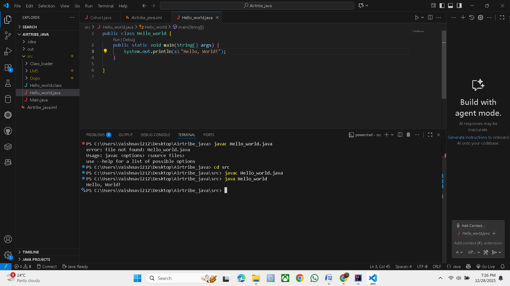

1. JDK Version Used? 
-> Java JDK 17

2. Screenshots or brief explanation of “Hello World” program run.
-> I installed Java JDK 17 on my system.  

   To verify the installation, I wrote a simple "Hello World" program.

   The program compiled successfully using the `javac` command and ran using the `java` command, printing "Hello World" on the console.  
   This confirms that Java is installed and configured correctly.
   

